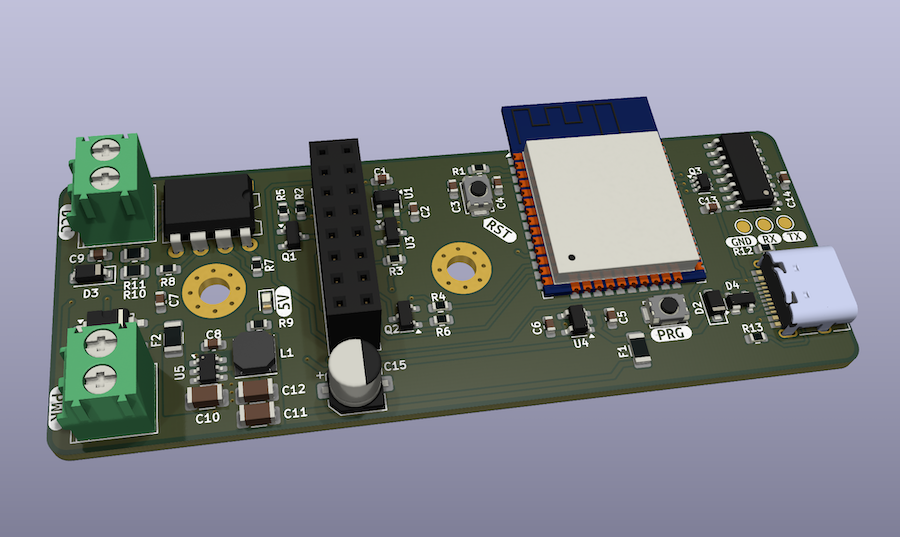

# Dual Display Billboard for scale modellers

## ESP32/ESP32-S3 Digital Billboard with Image Management

Dual display billboard system designed for scale modelers, featuring WiFi connectivity, image slideshow capabilities, multiple clock faces.

## Key Features

### **Dual Display Support**

- Independent control of two ST7735 (160x80) displays
- ST7789 (240x240) compatibility
- Hardware-specific pin mapping for ESP32 and ESP32-S3
- Content-aware rotation settings

### **Image Management**

- **10-image maximum limit** for optimal memory management
- JPEG validation with dimension checking
- 50KB per image size limit
- Automatic storage monitoring
- User-friendly error reporting

### **Multiple Clock Faces**

- **Modern Square**: Rounded border analog design with colored hands
- **Classic Analog**: Traditional analog clock with hour markers
- **Digital Modern**: Large font digital display
- **Minimalist**: Clean, simple time display

### **WiFi & Web Management**

- Captive portal setup for easy configuration
- WiFi network scanning and connection
- Web-based image upload interface
- Real-time system status monitoring

### **Code Architecture**

- Configurable logging system (ERROR/WARN/INFO levels)
- Memory management and error handling
- Modular component design

## Documentation

This project features comprehensive documentation generated from Doxygen-style annotations:

[API Documentation](https://srg74.github.io/Dual_display_billboard/api-docs/)

### **User Guides**

- **[Unicode Character Support Guide](docs/unicode_character_guide.md)** - How to add support for new international characters
- **[Hardware Connections](docs/hardware%20connections.md)** - Wiring and setup instructions
- **[Timezone Customization](docs/timezone_customization.md)** - Configure timezone settings

### **Code Documentation**

- **235+ documented methods** across 13 implementation files
- **19 fully documented header files** with complete API reference
- **Doxygen formatting** with @brief, @param, @return tags
- **Cross-references and usage examples** throughout
